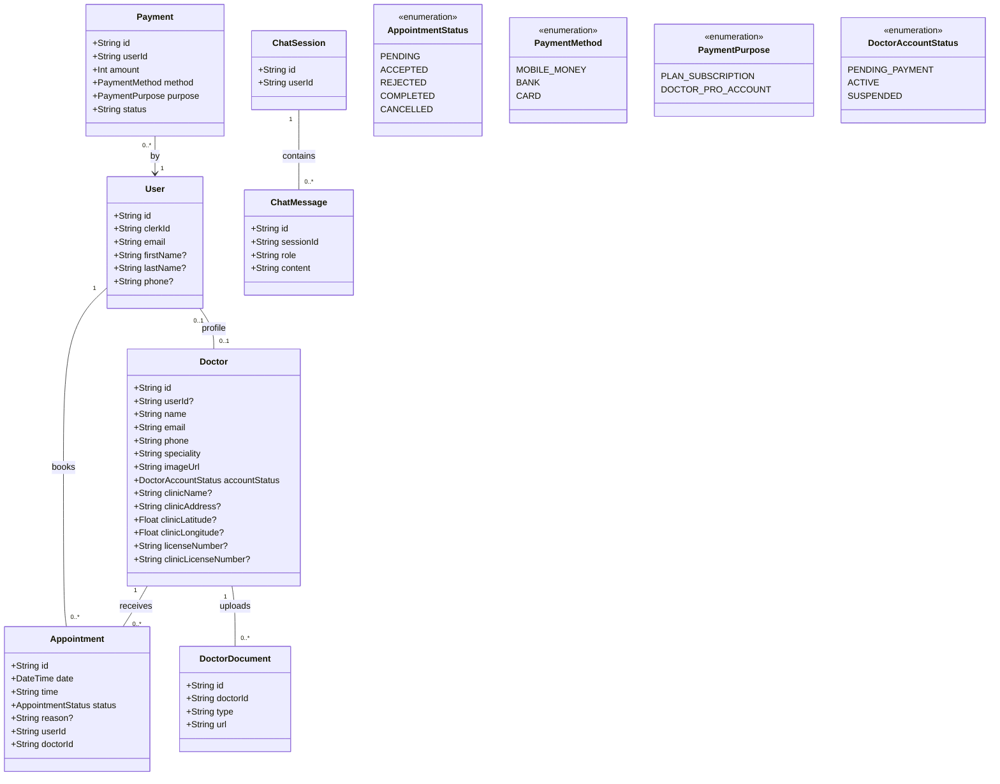

# DentWise Class Diagram

```mermaid
classDiagram
  direction TB

  class User {
    +String id
    +String clerkId
    +String email
    +String firstName?
    +String lastName?
    +String phone?
  }

  class Doctor {
    +String id
    +String userId?
    +String name
    +String email
    +String phone
    +String speciality
    +String imageUrl
    +DoctorAccountStatus accountStatus
    +String clinicName?
    +String clinicAddress?
    +Float clinicLatitude?
    +Float clinicLongitude?
    +String licenseNumber?
    +String clinicLicenseNumber?
  }

  class DoctorDocument {
    +String id
    +String doctorId
    +String type
    +String url
  }

  class Appointment {
    +String id
    +DateTime date
    +String time
    +AppointmentStatus status
    +String reason?
    +String userId
    +String doctorId
  }

  class ChatSession {
    +String id
    +String userId
  }

  class ChatMessage {
    +String id
    +String sessionId
    +String role
    +String content
  }

  class Payment {
    +String id
    +String userId
    +Int amount
    +PaymentMethod method
    +PaymentPurpose purpose
    +String status
  }

  class AppointmentStatus {
    <<enumeration>>
    PENDING
    ACCEPTED
    REJECTED
    COMPLETED
    CANCELLED
  }

  class PaymentMethod {
    <<enumeration>>
    MOBILE_MONEY
    BANK
    CARD
  }

  class PaymentPurpose {
    <<enumeration>>
    PLAN_SUBSCRIPTION
    DOCTOR_PRO_ACCOUNT
  }

  class DoctorAccountStatus {
    <<enumeration>>
    PENDING_PAYMENT
    ACTIVE
    SUSPENDED
  }

  User "1" -- "0..*" Appointment : books
  Doctor "1" -- "0..*" Appointment : receives
  Doctor "1" -- "0..*" DoctorDocument : uploads
  ChatSession "1" -- "0..*" ChatMessage : contains
  User "0..1" -- "0..1" Doctor : profile
  Payment "0..*" --> "1" User : by
```

## Source

This diagram is based on `prisma/schema.prisma`.
