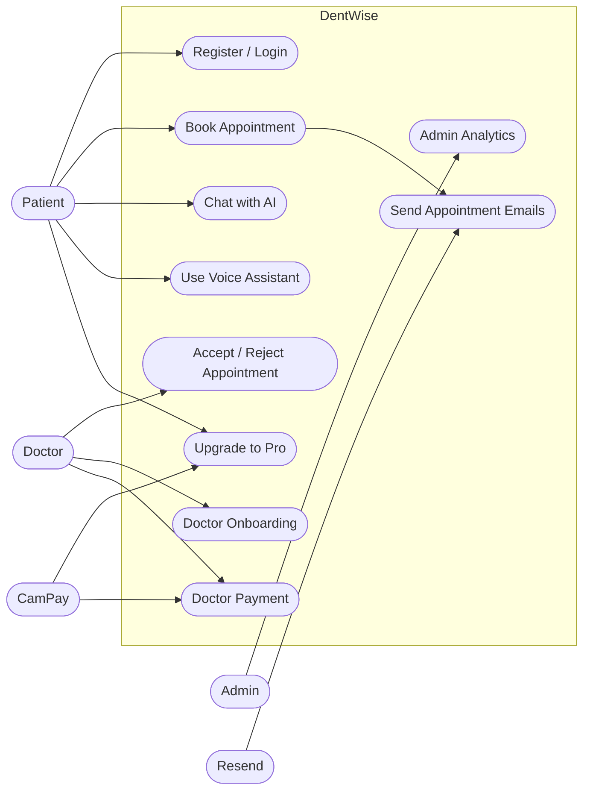

```mermaid
flowchart LR
  subgraph DentWise
    UC1([Register / Login])
    UC2([Book Appointment])
    UC3([Accept / Reject Appointment])
    UC4([Chat with AI])
    UC5([Use Voice Assistant])
    UC6([Upgrade to Pro])
    UC7([Doctor Onboarding])
    UC8([Doctor Payment])
    UC9([Admin Analytics])
    UC10([Send Appointment Emails])
  end

  Patient([Patient]) --> UC1
  Patient --> UC2
  Patient --> UC4
  Patient --> UC5
  Patient --> UC6

  Doctor([Doctor]) --> UC3
  Doctor --> UC7
  Doctor --> UC8

  Admin([Admin]) --> UC9

  Payment([CamPay]) --> UC6
  Payment --> UC8

  Email([Resend]) --> UC10
  UC2 --> UC10
```
